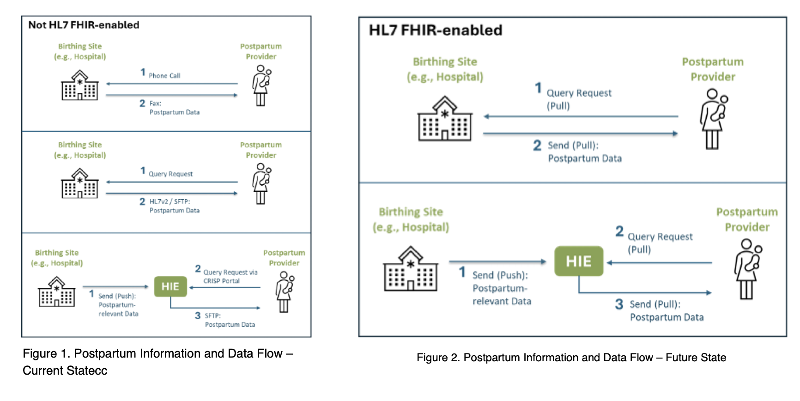

# USCDI+ Maternal Health Postpartum Transitions of Care FHIR IG

1.1 **Introduction**
Rates of maternal mortality for pregnant women and new mothers is on the rise, and it is paramount that providers, across care settings, have access to reliable and accurate health data to inform treatment and interventions. However, current gaps in standardized, interoperable data to exchange across health care settings can limit providers’ ability to access necessary health data to effectively manage and deliver high-quality care. Effective communication and data sharing across these settings are crucial to address ongoing health needs, manage chronic conditions, and support the mother's transition to primary care.

1.	Prenatal Care: Prenatal care typically occurs in outpatient clinics, where obstetricians, midwives, or family physicians monitor the pregnancy through regular visits. 
2.	Delivery Encounter: When labor begins, care shifts to a hospital or birthing center, where a different team manages the delivery.
3.	Postpartum TOC: After childbirth, the mother returns to outpatient care for postpartum follow-up. Data relevant to postpartum is care is siloed across multiple prenatal encounter summaries and is either missing or captured as unstructured data from the hospital encounter.

2.0 **Data Exchange: Current and Future State**

The USCDI+ MH domain extends the USCDI core dataset by establishing maternal health specific data elements for use in delivering care and conducting research on health outcomes for pregnant women. The USCDI+ MH Postpartum TOC Use Case focuses specifically on interoperable data exchange between health IT solutions that support obstetric care providers in caring for pregnant and postpartum patients and associated federal quality and reporting programs with electronic measures and datasets pertaining to postpartum outcomes. 

Currently, Clinical Document Architecture (CDA) and Consolidated-Clinical Document Architecture (C-CDAs) are used to exchange both structured and unstructured data, such as narrative notes in a document format (e.g., Discharge Summary, History & Physical notes, and Encounter Summary). There is no standardized Postpartum Summary note that facilitates the exchange of postpartum summary information and ensures that essential postpartum data is captured and exchanged in a structured, consistent manner when individuals transition from inpatient to outpatient care after pregnancy. 

Health Level Seven (HL7) FHIR has not yet been widely adopted for maternal health data exchange. Although some support exists, such as through the ASTP USCDI and the HL7 FHIR US Core IG, its application to postpartum use cases remains limited. Major barriers include the absence of a standardized set of postpartum data elements and a lack of guidance on appropriate value sets. This presents an opportunity for the development of a FHIR IG for the Postpartum TOC Use Case. 

